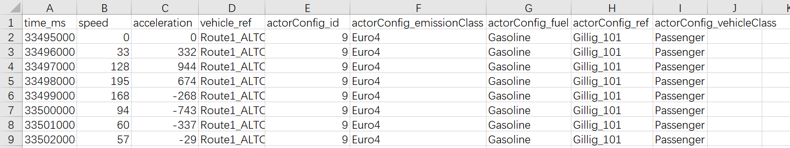
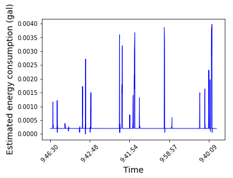

# Transit-GYM

The following project describes the procedures necessary to simulate the public transit in the city of Chattanooga. The approach is generalizable and can be extended to other cities. The paper [TRANSIT-GYM: A Simulation and Evaluation Engine for Analysis of Bus Transit Systems](https://ieeexplore.ieee.org/abstract/document/9556290) provides details about the work. Refer to [Presentation-Transit-Gym-SmartComp2021.pdf](Presentation-Transit-Gym-SmartComp2021.pdf) for a powerpoint presentation about the simulation framework.

Below you will find the installation instructions and steps required to run a few example simulations.
Please refer to [Manual Files](manual_files) if you are looking for **manual steps** to create the simulation environment. Otherwise follow the steps below that provide helper scripts. During these steps we refer to two different scenarios:

1. [Hello World](examples/HelloWorld/): a simple example that demonstrates the full functionality and usages.
2. [Chattanooga_CS_24_hours](examples/Chattanooga_CS_24_hours/): an environment for transit simulation within the Chattanooga area.
3. [examples/Chattanooga_CS_cal](examples/Chattanooga_CS_cal): an example that includes updated matrices that were calibrated using real traffic from streets. Refer to [calibration-poster.pdf](calibration-poster.pdf) for details.

A youtube presentation of this work is available at [https://youtu.be/Fw4UQGcB80o](https://youtu.be/Fw4UQGcB80o).

##### **Disclaimer**: Using Docker is more secure and reliable way of running the simulation. Please keep in mind that this would **not be compatible** with the [sim_without_bg_traffic](sim_without_bg_traffic) process that requires results from this. Please use the [Regular simualtion method](#regular) for compatibility.

# Docker Instructions

**Disclaimer**: Using Docker is more secure and reliable way of running the simulation. Please keep in mind that this would **not be compatible** with the [sim_without_bg_traffic](sim_without_bg_traffic) process that requires results from this. Please use the [Regular simualtion method](#regular) for compatibility.

Assuming you have docker command line, follow these instructions

```
$ git clone https://github.com/smarttransit-ai/transit-gym.git 
$ cd transit-gym/sim_with_bg_traffic
$ docker build -t transit-gym-docker .
```

Now you can run various examples. create a directory where results will be stored and then launch docker into root and mount simulation_output to /simulation_output. The docker will provide a prompt into the container. The container number 37a93e9abef8 will be different on your machine.

```
$ mkdir simulation_output  # 
$ docker run -t -i -v `pwd`/simulation_output:/simulation_output transit-gym-docker bash  
root@37a93e9abef8:/# 
```

Now launch example

```
root@bf8aa1fdcd33:/# cd transit-gym/examples/HelloWorld/
root@bf8aa1fdcd33:/transit-gym/examples/HelloWorld# python driver.py 
```

The output will look like the following

```
root@bf8aa1fdcd33:/transit-gym/examples/HelloWorld# python driver.py 
Sun Feb 20 00:55:18 2022 : Generating Configuration files for Simulation from  helloworld.transsim
Sun Feb 20 00:55:18 2022 : running od2trips
Sun Feb 20 00:55:19 2022 : od2trips done
Sun Feb 20 00:55:19 2022 : running duarouter. Takes time.
Sun Feb 20 01:25:08 2022 : duarouter done

Config File Saved. Please find configured simulation file at: ./Simulation_1

Sun Feb 20 01:25:08 2022 : Done.
Sun Feb 20 01:25:08 2022 : Starting Simulation. Calling Sumo:  sumo ./Simulation_1/config.sumocfg
Sun Feb 20 01:28:51 2022 : Simulation Complete - Proceeding to output processing
/usr/local/lib/python3.9/dist-packages/transsim/Output_Processor.py:45: DtypeWarning: Columns (6) have mixed types. Specify dtype option on import or set low_memory=False.
  edgeO = pd.read_csv(result_path + "EdgeMean.csv",sep=';')
Sun Feb 20 01:29:13 2022 : All Done
```

Now move the results to host machine

```
root@bf8aa1fdcd33:/transit-gym/examples/HelloWorld# mv Simulation_1/ /simulation_output/HelloWorld_Simulation_1
root@bf8aa1fdcd33:/transit-gym/examples/HelloWorld# exit
exit

```

Now the simulation results will be in host machine.

```
(base) host-machine:simulation_output $ tree
.
└── HelloWorld_Simulation_1
    ├── EdgeMean.csv
    ├── EdgeMean.xml
    ├── Person_trips.xml
    ├── busstop_output.csv
    ├── busstop_output.xml
    ├── config.sumocfg
    ├── edge.dump.add.xml
    ├── error_warning_log.xml
    ├── final_routefile.alt.xml
    ├── final_routefile.xml
    ├── output
    │   ├── Trajectory_Route1.0_ALTON_PARK_block107.0_trip151657020.csv
    │   ├── busstop_info.csv
    │   └── edge_info.csv
    ├── raw_routefile.xml
    ├── stopfile.add.xml
    ├── trajectories_output.xml
    ├── trajectories_outputactorConfig.csv
    ├── trajectories_outputmotionState.csv
    ├── trajectories_outputvehicle.csv
    └── vehicle.add.xml

2 directories, 20 files
(base) host-machine:simulation_output $ 


```

# [Regular Installation Instructions (without Docker)](#regular)

## Step 1. Install packages

python >= 3.6 required for dependencies to work.

Optional : create a virtual environment
Install required python packages from requirements.txt

```
$ pip3 install -r requirements.txt
```

Navigate to /transit-gym/src, create a python venv (or use install for all environments). Use the command "***pip install .***" to install the package into your environment.

```
$ cd transit-gym/src
$ pip3 install .
```

## Step 2. Run simulation

Now you can run various examples included with the installation. These examples are:

* [HelloWorld](examples/HelloWorld) - a basic example that shows the installation is ready.
* [Chattanooga_CS_900_1000](examples/Chattanooga_CS_900_1000) - an example that shows how you can change the time of simulation. For example compare the time value in [Chattanooga_CS_900_1000.transsim](examples/Chattanooga_CS_900_1000/Chattanooga_CS_900_1000.transsim) and [Chattanooga_CS_backup.transsim](examples/Chattanooga_CS_900_1000/Chattanooga_CS_backup.transsim). This simulation will equire you to download the route file from [dropbox](https://www.dropbox.com/s/6sr0w60d96098v3/Chattanooga_Daily_Trips.rou.xml.tar.gz?dl=0). Extract the tar.gz in the routes folder of examples/Chattanooga_CS_900_1000.
* Following two simulations show full day results. But will take a long time to run.
  * [Chattanooga_CS_24_hours](examples/Chattanooga_CS_24_hours) describes a 24 hour simulation using the travel demand obtained from the chattanooga planning department. This simulation can take longer than 24 hours to run. It will require you to download the route file from [dropbox](https://www.dropbox.com/s/6sr0w60d96098v3/Chattanooga_Daily_Trips.rou.xml.tar.gz?dl=0). Extract the tar.gz in the routes folder of examples/Chattanooga_CS_24_hours.
  * [Chattanooga_CS_cal](examples/Chattanooga_CS_cal) demonstrates the 24 hour simulation after a careful calibrartion of demand to ensure the traffic characteristic inside the simulation match that seen in real world. Refer to [calibration-poster.pdf](calibration-poster.pdf) for the calibration procedures that we used. Note for this example, you need to download route file Chattanooga_trips_cal.rou.xml from [dropbox](https://www.dropbox.com/s/1tn7an1rijfyafa/Chattanooga_trips_cal.rou.xml.tar.gz?dl=0) (bigger than what can be stored in github).  Download the calibrated routes file and put in the /routes/ folder. Extract the tar.gz in the routes folder of examples/Chattanooga_CS_cal.

Note for each of the simulation, the folder contains the following file structure

* /network/ - The network files. Note you need to **extract the zip file in the folder at the same location**. This network file describes chattanooga road map.
* /taz/ - The taz.xml for transportation demand.
* /bus-stop/ - Configured bus stop excel file. Format should be same as [example](sim_with_bg_traffic\examples\Chattanooga_CS_24_hours\bus-stop\busstops.xlsx).
* /gtfs/ - Apporpriate GTFS files (can be downloaded from [Transitfeeds](https://transitfeeds.com/))
* /gui/ - gui.view.xml for sumo config.
* /travel-demand/ -.od file for transportation demand.
* /vehicle-types/ - Apporpriate excel file for vehicle stats.
* /routes/ - Routes to be included in the simulation if needed. (Optional)

These files can be generated by following the steps in [manual_files](sim_with_bg_traffic\manual_files)

Thereafter, you can always run the simulation by going into the example directory  and asking to run the driver program.

```
$ python3 driver.py
```

The result will be available in `Simulation_1\output\` after it completes.

An example output of the Trajectory generated from the hello world example is shown below.



## Step 3. Post processing of outputs

The outputs generated by the simulation can be processed to compute energy estimates for the transit network. This utilizes the work done by our macro and [micro prediction models](https://github.com/smarttransit-ai/micro-energy-prediction). A report about this is available at [https://smarttransit.ai/files/HDEMMA_2021_Report.pdf](https://smarttransit.ai/files/HDEMMA_2021_Report.pdf)

Use the notebooks in [energy_estimation](energy_estimation) folder to generate these results.

Required inputs:

**model_folder**: location of the energy estimation models (by default, stored in the **models** folder)

**output_folder**: output folder of trip wise trajactories received from the simulation ( in our case, the **output** folder)

**energy_folder**: to save the prediction results

**weather**: rainy, sunny, windy, or snowy

1. Compute the energy estimates. Fill the corresponding **folder names** in the script and run [Energy_estimation.ipynb](energy_estimation/Energy_estimation.ipynb). The output notebook is stored in a .html file. The energy estimation results are saved as well.

```
$ jupyter nbconvert --execute Energy_estimation.ipynb
```

2. Plot Energy Estimates across trajectories for vehicles. Run the script [plot_energy_estimation.ipynb](energy_estimation/plot_energy_estimation.ipynb) with the energy estimation results.

```
$ jupyter nbconvert --execute plot_energy_estimation.ipynb
```

Here is an example plot that shows the output of estimate energy usage from the results of Hello_World simulation.


3. Plot the occupancy of buses.  Plot occupancy of buses. Read the "busstop_info.csv" from the simulation output folder and run the script [plot_occupancy.ipynb](manual_files/output/visulization%20example/plot_occupancy.ipynb).

```
$ jupyter nbconvert --execute plot_occupancy.ipynb
```

## Optional : Step 4. Updating GTFS files

Change the GTFS Schedule by changing "import "gtfs.20200816"" to other gtfs file name, such as "import "gtfs.20211024"" in the transsim file. For example, in  [Chattanooga_CS_24_hours_cal.transsim](examples/Chattanooga_CS_cal/Chattanooga_CS_24_hours_cal.transsim) change **import "gtfs.20200816"** to **import "gtfs.20211024"**

## Optional : Step 5. Changing the Vehicle Assignment

Change the vehicle Assignment by changing the content of "vehicleassignment{}" in .transsim files in the respective example and run: python3 driver.py

# Acknowledgement

This material is based upon work supported  by National Science Foundation under grants CNS-1952011, CNS-2029950 and Department of Energy, Office of Energy Efficiency and Renewable Energy (EERE), under Award Number DEEE0008467. Any opinions, findings, and conclusions or recommendations expressed in this material are those of the author(s) and do not necessarily reflect the views of the National Science Foundation or the Department of Energy.
