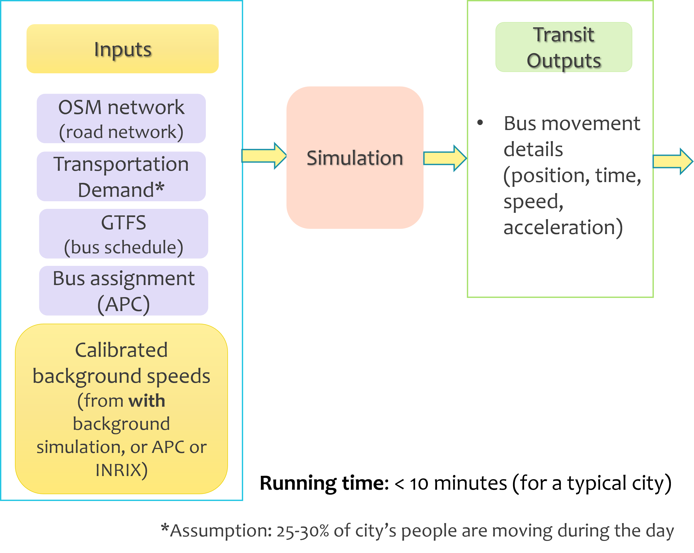
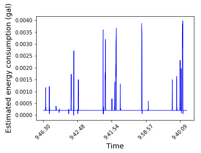

# Process outline



# 1. Unzip the SUMO network file (if using the provided city's network)

```bat
$ unzip transit-sim-date/Chattanooga_SUMO_Network.net.xml.zip
```

# 2. (optional) Generate the pre-requisite files (under ./transit-sim-date)

### (applicable when simualting a new city/changed network, demand)

We can generate the follwing files:

-**network**<br>
-**person_trips**<br>
-**sumo configuration** <br>

by following the steps in the **[manual_files](manual_files)** folder.

We also create a [parking.xml](transit-sim-date/parking.add.xml) file to make a virtual parking location, where the buses are intermediately stored when not in use. It can be any randomly chosen empty space on the map.

Next, follow Steps 3 to 7 to generate the simualtion without background traffic

# 3. Generate trip-assignment files

File: Pre-processing/generate-trip-assignment.py

Inputs:

- GTFS (example GTFS stored in GTFS/20210815)
- APC (example APC data stored in APC/202108.parquet)\
  - the original APC data format is used
- date (in YYYYMMDD format)

Command:

```bat
$ cd Pre-processing
$ python generate-trip-assignment.py --GTFS ../GTFS/20210815 --APC ../APC/202108.parquet --date 20210820
```

Output:

- Pre-processing/trip-assignments/trip-asm-20210820.csv

# 4. Generate bus route files

File: generate-route.py

Inputs:

- GTFS extarcted folder (example GTFS stored in GTFS/20210815)
- date (in YYYYMMDD format)
- simulation folder (by default, transit-sim-date)
- SUMO_PATH: the installation location of SUMO (by default, /usr/bin/sumo)

Command:

```bat
$ python generate-route.py --GTFS GTFS/20210815 --date 20210820 --sim transit-sim-date --SUMO_PATH /usr/bin/sumo
```

Outputs:

- transit-sim-date/routes-20210820.rou.xml
- transit-sim-date/busStop-20210820.add.xml

# 5. Generate transit demand file

We will use the duarouter feature, which is packaged with SUMO.

$ cd transit-sim-date

```bat
$ duarouter --route-files routes-**{DATE}**.rou.xml,Person_trips.xml --net-file Chattanooga_SUMO_Network.net.xml --unsorted-input --additional-files busStop-**{DATE}**.add.xml,parking.add.xml  --output-file passenger-**{DATE}**.rou.xml --ignore-errors
```

Example:

```bat
$ duarouter --route-files routes-20210820.rou.xml,Person_trips.xml --net-file Chattanooga_SUMO_Network.net.xml --unsorted-input --additional-files busStop-20210820.add.xml,parking.add.xml  --output-file passenger-20210820.rou.xml --ignore-errors
```

Outputs:

- transit-sim-date/passenger-20210820.rou.xml

# 6. Run simulation with BTE

File: run-BTESim.py

Inputs:

- date (in YYYYMMDD format)
- simulation folder (by default, transit-sim-date)
- background traffic (by default, BTE/edge_speed_by_sim.pkl)
- SUMO_PATH: the installation location of SUMO (by default, /usr/bin/sumo)

Command:

```bat
$ python run-BTESim.py --date 20210820 --sim transit-sim-date --BTE_data BTE/edge_speed_by_sim.pkl --SUMO_PATH /usr/bin/sumo
```

Outputs:

- transit-sim-date/busstop_output.xml
- transit-sim-date/trajectory_output.xml

# 7. Post-processing - from block-level to trip level

The results we generate till are in the form of *blocks*. We now convert them to individual trips, by comparing them the input GTFS data.

File: Post-processing/outputProcess.py

Inputs:

- date (in YYYY-MM-DD format)

Command:

```bat
$ python Post-processing/outputProcess.py --date 2021-08-20
```

Outputs

- Post-processing/trip-level-output/busstop_info.csv
- Post-processing/trip-level-output/trajectory-{trip_id}.csv

These outputs contain the **trip level information** of each simulated trip, during the given time period.

### 8. Further Analysis - Energy estimation

The outputs generated by the simulation can be processed to compute energy estimates for the transit network. This utilizes the work done by our macro and [micro prediction models](https://github.com/smarttransit-ai/micro-energy-prediction). A report about this is available at [https://smarttransit.ai/files/HDEMMA_2021_Report.pdf](https://smarttransit.ai/files/HDEMMA_2021_Report.pdf)

Use the notebooks in [energy_estimation](energy_estimation) folder to generate these results.

Required inputs:

**model_folder**: location of the energy estimation models (by default, stored in the **models** folder)

**output_folder**: output folder of trip wise trajactories received from the simulation ( in our case, the **trip-level-output** folder)

**energy_folder**: to save the prediction results

**weather**: rainy, sunny, windy, or snowy

1. Compute the energy estimates. Fill the corresponding **folder names** in the script and run [Energy_estimation.ipynb](energy_estimation/Energy_estimation.ipynb). The output notebook is stored in a .html file. The energy estimation results are saved as well.

```
$ jupyter nbconvert --execute Energy_estimation.ipynb
```

2. Plot Energy Estimates across trajectories for vehicles. Run the script [plot_energy_estimation.ipynb](energy_estimation/plot_energy_estimation.ipynb) with the energy estimation results.

```
$ jupyter nbconvert --execute plot_energy_estimation.ipynb
```

Here is an example plot that shows the output of estimate energy usage from the results of Hello_World simulation.Plot the occupancy of buses. Plot occupancy of buses. Read the "busstop_info.csv" from the simulation output folder and run the script [plot_occupancy.ipynb](manual_files/output/visulization%20example/plot_occupancy.ipynb).

```
$ jupyter nbconvert --execute plot_occupancy.ipynb
```



## Frequently Asked Questions

They acan be found in the Results and Discussions in[ BTETransitSimReport](..\docs\BTETransitSimReport.pdf)
